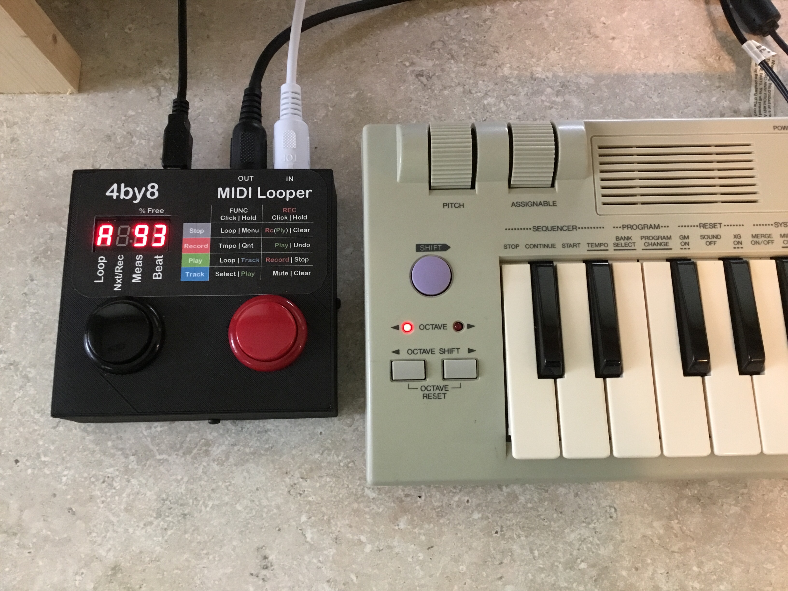
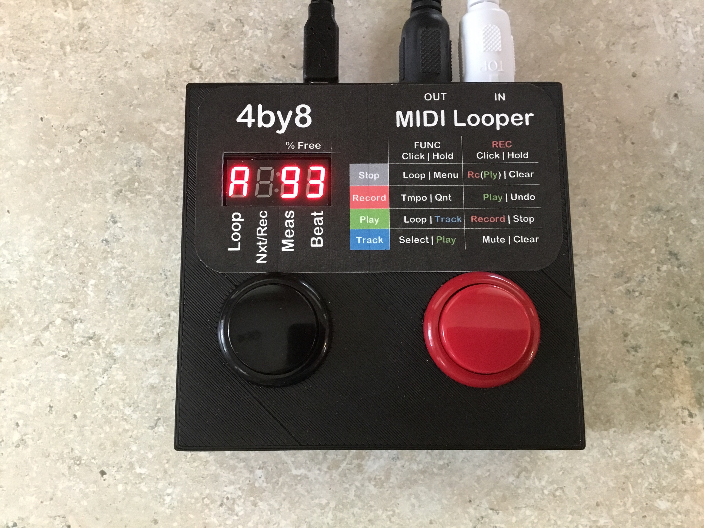
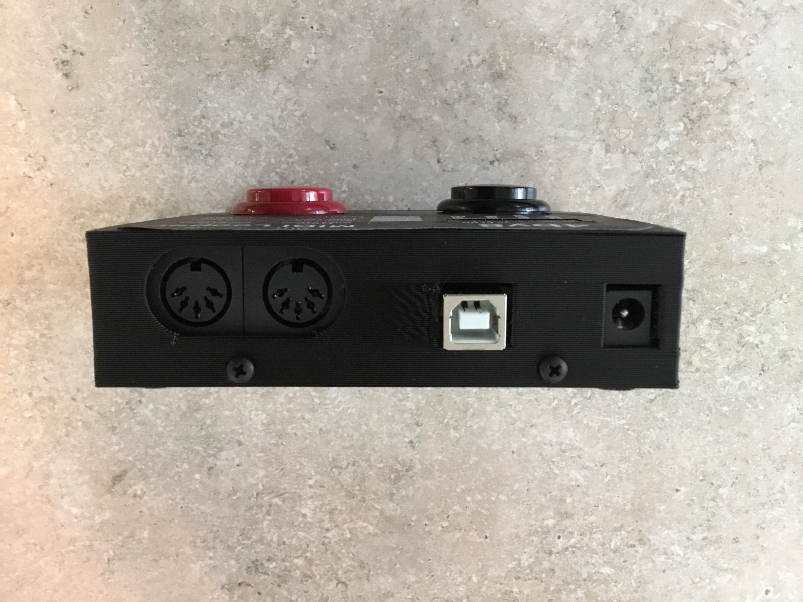

## What is it?

4by8 is a MIDI Looper inspired by guitar looper pedals and sequencers like the Alesis MMT-8.  

* 4 Loops, each with 8 tracks.  Record on any MIDI channel. 
* One click to start recording.  One click to save.  One click to overdub.
* Real-time quantization and gating of your input. Instant undo.  
* Sync to external MIDI clock, or send MIDI clock sync.
* Mute/Unmute tracks while playing, switch between recorded loops

<iframe width="760" height="520" src="https://www.youtube.com/embed/D32h0h87aZI?ecver=1" frameborder="0" gesture="media" allowfullscreen></iframe>

<iframe width="760" height="520" src="https://www.youtube.com/embed/6obFfSdbHx4?ecver=1" frameborder="0" gesture="media" allowfullscreen></iframe>

## How do I connect it?

Power the 4by8 with a USB power adapter and the included USB cable, or use a 9V center positive power adapter.  Connect your controller to the 4by8 IN port, and your MIDI sound sources to the OUT port.

## How do I use it?

<a target="_blank" href="images/4by8 Manual FV 1.01.pdf">READ THE MANUAL HERE</a>

## Detailed Specs

* 400 Note Capacity
* 4 Switchable Loops
* 8 Tracks per Loop, individually mutable
* 2-8 Measures Per Loop
* 2-7 Beats Per Measure
* Triplet and 16th Note Modes
* Quantize and Gate to 1/4, 1/8, 1/16, 1/32 notes
* Sync to MIDI Start/Stop/Clock 
* Simple 2 Button Operation

## How much is it?

 * Price is $84 USD.
 * Shipping is $10 to the US.  
 * Shipping is $35 outside the US, as long as USPS Priority Mail delivers to your location.  I must declare the full price of the item on the customs form, please do not ask me to mark it as "gift", etc.
 
## How can I get one?

Scroll down to order via PayPal or credit card.  

*Please Read All of the Following carefully before ordering:*

* The enclosure is 3D printed. 3D printed objects have a textured appearance, please see pictures. 
* Refunds offered with evidence that there is an electronic fault with the product.  

### CURRENT STATUS:  OUT OF STOCK.  Pre-order now for shipping on or before February 11, 2019.

<form action="https://www.paypal.com/cgi-bin/webscr" method="post" target="_top">
<input type="hidden" name="cmd" value="_s-xclick">
<input type="hidden" name="hosted_button_id" value="SS9SLN6CBE4R8">
<table>
<tr><td><input type="hidden" name="on0" value="Options">Options</td></tr><tr><td><select name="os0">
	<option value="US Shipping">US Shipping $94.00 USD</option>
	<option value="International Shipping">International Shipping $119.00 USD</option>
</select> </td></tr>
</table>
<input type="hidden" name="currency_code" value="USD">
<input type="image" src="https://www.paypalobjects.com/en_US/i/btn/btn_buynowCC_LG.gif" border="0" name="submit" alt="PayPal - The safer, easier way to pay online!">

</form>

## SUPPORT

Please contact me:  <a href="mailto:iestyn.lewis@gmail.com">iestyn.lewis@gmail.com</a>

The latest firmware version is 1.01.  To determine your device's firmware version, unplug your 4by8 and plug it back in again.  Immediately after the 4by8 "splash" appears, your firmware version will be displayed.  If you would like to upgrade your firmware, please contact me for directions.

### Firmware Version History

* 1.00 - Initial version.
* 1.01 - Added External MIDI Clock Sync.  Minor tweaks to recording interface.

